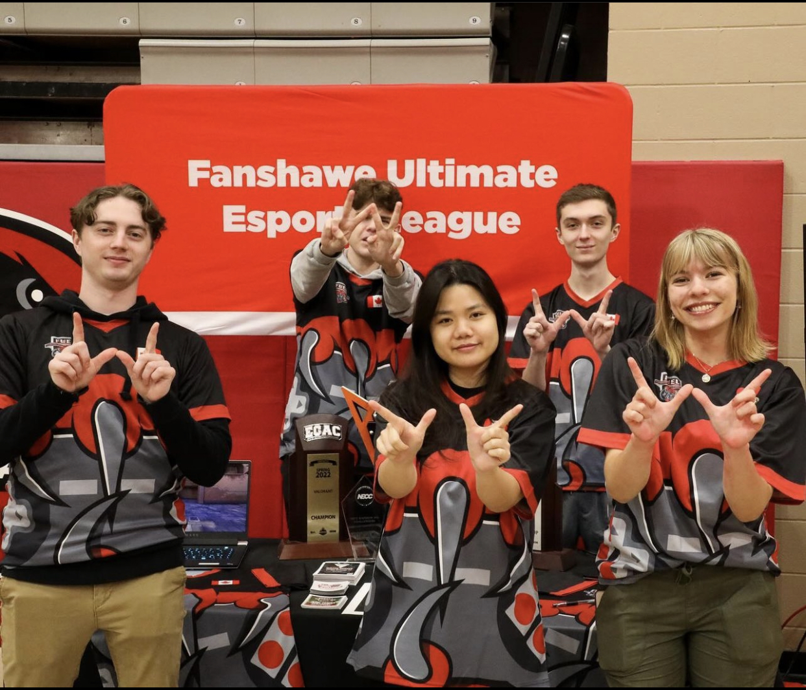
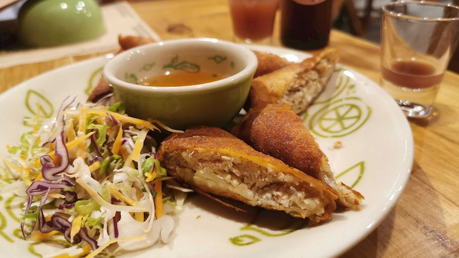
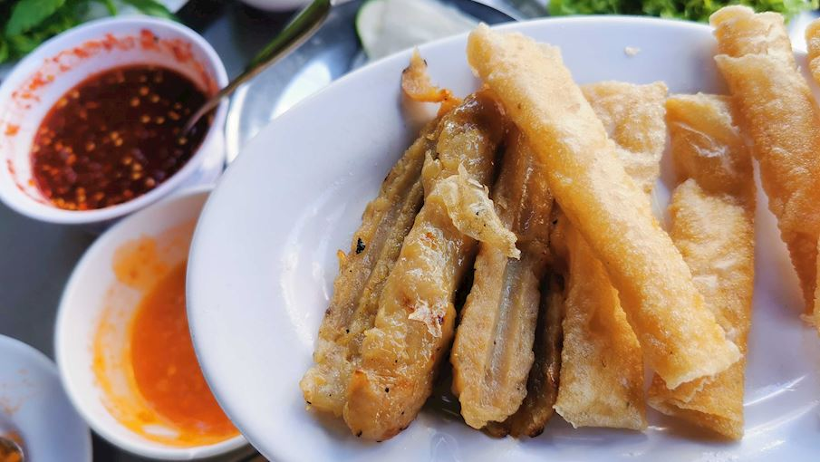

# HW1
There is a repo for the HW1

## Nguyen ThiThanhThuong & Ho GiaKhang

**Vietnamese Cuisine**

## Nguyen ThiThanhThuong

Hello, I am from Vietnam. I am very glad to be one student of IDP3. I want to become a wed designer in the future. 

Currently, I am working at Fanshawe Fuel as a Content Creator.

I also love foods from my country.

**Vietnamese Appetizers**

1. Fried Spring Rolls - Frequent additions to the stuffing include vegetables such as carrots, cabbage, or mushrooms, glass noodles, and bean sprouts.

2. Fresh Rolls - These crispy fressh rolls are prepared by wrapping soaked rice paper (bánh tráng) around various ingredients.

3. Grilled Pork Sausage - The sausage is usually made with a combination of ground pork fat and meat, garlic, fish sauce, shallots, sugar, black pepper, and often baking soda that's used for puffing up the meat.

*These appetizers rankings are based on the ratings of the TasteAtlas audience, with a series of mechanisms that recognize real users and that ignore bot, nationalist or local patriotic ratings, and give additional value to the ratings of users that the system recognizes as knowledgeable.*

**Notice**

Things need to notice:
- eat with suitable sauces
- eat when they are hot

Recipe Type: 
- Mordern
- Traditional

Other appetizers to go: 
[Vietnamese Appetizers](https://www.hungryhuy.com/vietnamese/appetizers/)